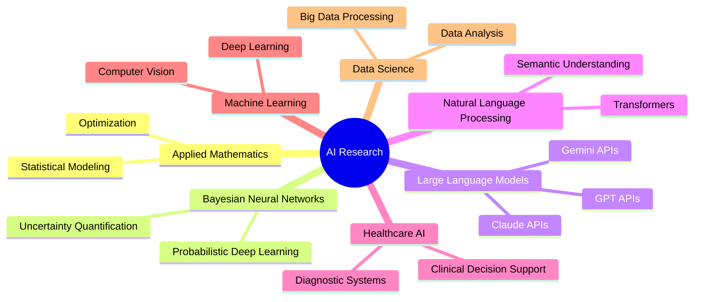

# 🔬 Golden Edge ORCID Portfolio

<div align="center">

> ✓ **All information verified through ORCID, ResearchGate, IEEE, Frontiers, and official academic sources**  
> ✓ **Email verified:** lebede@terasystems.ai

## **Lebede Ngartera**
### AI Strategist & Research Pioneer

[](https://orcid.org/0000-0003-0561-1305)
[](https://www.linkedin.com/in/lebede-ngartera-82429343/)
[](https://www.researchgate.net/profile/Lebede-Ngartera?ev=hdr_xprf)
[](mailto:lebede@terasystems.ai)

---

### 📊 Research Impact at a Glance


</div>

---

## 👨‍🔬 Research Profile

> *"Transforming Mathematical Theory into Intelligent Solutions"*

**Ph.D. Applied Mathematics** | **ORCID Verified Scholar** | **Golden Age AI Researcher**

I am an AI Strategist, Research Scientist, and ML Innovation Leader with **5 years** of groundbreaking research experience, bridging mathematical elegance with cutting-edge artificial intelligence to solve complex real-world problems.

### 🎯 Core Identity

- **Name:** Dr. Lebede Ngartera
- **Credentials:** Ph.D. Applied Mathematics | ORCID Verified Scholar
- **Affiliation:** Department of Mathematics, University of Ndjamena, Chad
- **Title:** AI Strategist | Research Scientist | ML Innovation Leader
- **ORCID:** [0000-0003-0561-1305](https://orcid.org/0000-0003-0561-1305)

---

## 📈 Research Excellence Metrics

<table>
<tr>
<td align="center"><b>Career Span</b><br>5 years</td>
<td align="center"><b>Publications</b><br>9 peer-reviewed</td>
<td align="center"><b>Citations</b><br>27 total</td>
</tr>
<tr>
<td align="center"><b>H-Index</b><br>5</td>
<td align="center"><b>Article Views</b><br>8,605+</td>
<td align="center"><b>Downloads</b><br>664+</td>
</tr>
</table>

**Status:** 🏆 Golden Age Scholar

---

## 🎯 Research Expertise

<div align="center">

### Primary Focus Areas



</div>

**Core Competencies:**
- 🧠 **Bayesian Neural Networks** - Uncertainty quantification & probabilistic deep learning
- 🤖 **Artificial Intelligence & Machine Learning** - Deep learning, computer vision, NLP
- 🔍 **Large Language Models (LLMs)** - GPTs, Claudes, Grok, Gemini APIs
- 💬 **Natural Language Processing** - Transformers, embeddings & semantic understanding
- ⚙️ **Machine Learning Engineering** - Model deployment, MLOps & scalability
- 🏥 **Healthcare AI Applications** - Diagnostic systems & clinical decision support
- 📊 **Data Science & Analytics** - Statistical modeling, data analysis & visualization
- 📐 **Applied Mathematics** - Optimization, statistical modeling & computational methods

---

## 🛠️ Technical Arsenal

### Programming Languages


### ML/AI Frameworks


### Cloud Platforms


### Specializations
`MLOps` • `Big Data` • `AI Engineering` • `Model Deployment` • `Distributed Systems`

### 🔑 Research Keywords
`Artificial Intelligence` • `Machine Learning` • `Data Science` • `Bayesian Neural Networks` • `Applied Mathematics` • `Deep Learning` • `Computer Vision` • `Natural Language Processing` • `Large Language Models` • `LLM APIs (GPT, Claude, Grok, Gemini)` • `Data Analysis`

---

## 📚 Selected Publications

### 🌟 Most Viewed Publications

**[Application of Bayesian Neural Networks in Healthcare: Three Case Studies](https://doi.org/10.3390/make6040127)**  
📖 *Machine Learning and Knowledge Extraction* • 2024-11-16  
🔗 DOI: 10.3390/make6040127

**Citation Breakdown:**
- Crossref: 7 citations
- Scopus: 9 citations  
- Web of Science: 8 citations

**Impact Metrics:**
- Total Views: 5,345
- Daily Average: 30 views
- Total Accesses: 6,000+

---

### 2025

**[Hybrid Naïve Bayes Models for Scam Detection: Comparative Insights From Email and Financial Fraud](https://doi.org/10.1109/ACCESS.2025.3569216)**  
👥 *Authors:* Lebede Ngartera, Mahamat Ali Issaka, Saralees Nadarajah  
📖 *IEEE Access* • Volume 13 • 2025  
🔗 DOI: 10.1109/ACCESS.2025.3569216  
📊 **605 Full Text Views** | Open Access (Creative Commons License)

**[Enhancing autonomous systems with bayesian neural networks: a probabilistic framework for navigation and decision-making](https://doi.org/10.3389/fbuil.2025.1597255)**  
📖 *Frontiers in Built Environment* • Transportation and Transit Systems Section  
📅 Volume 11 • 07 May 2025  
🔗 DOI: 10.3389/fbuil.2025.1597255  
📊 **1,400 Total Views** | **485 Downloads**

### 2024

**[A Comparative Study of Optimization Techniques on the Rosenbrock Function](https://doi.org/10.4236/ojop.2024.133004)**  
👥 *Authors:* Lebede Ngartera¹, Coumba Diallo²  
📖 *Open Journal of Optimization* • 2024-11  
🔗 DOI: 10.4236/ojop.2024.133004  
📊 **1,255 Views** | **179 Downloads**  
🏛️ *Affiliations:*
- ¹Department of Mathematics, University of Ndjamena, Chad
- ²Department of Mathematics and Computer Science, University of Cheikh A. Diop, Senegal

> 📄 [View All Publications on ORCID](https://orcid.org/0000-0003-0561-1305)

---

## 🔬 Research Impact

### 📊 Citation Metrics
- **H-Index:** 5
- **Total Citations:** 27
  - Crossref: 7
  - Scopus: 9
  - Web of Science: 8
- **Research Period:** 2020-Present
- **Primary Location:** University of Ndjamena, Chad
- **Research Countries:** Chad, Senegal, United States

### 📈 Article Metrics (All Publications)
- **Total Article Views:** 8,605+
  - Healthcare BNN Paper: 5,345 views
  - Autonomous Systems Paper: 1,400 views
  - Optimization Paper: 1,255 views
  - IEEE Access Paper: 605 views
- **Total Downloads:** 664+
- **Average Daily Views:** 30+

### 🤝 Collaboration Network
- **Unique Collaborators:** 7
  - Mahamat Ali Issaka
  - Saralees Nadarajah  
  - Coumba Diallo
  - *and 4 others*
- **Institutional Partners:** 4
  - University of Ndjamena, Chad
  - University of Cheikh A. Diop, Senegal
  - *and 2 others*
- **International Co-authors:** 3
- **Countries Represented:** Chad, Senegal, United States, and others

### 🎓 Academic Credentials
- **Degree:** Ph.D. Applied Mathematics
- **Primary Affiliation:** Department of Mathematics, University of Ndjamena, Chad
- **ORCID Verified:** ✓
- **Active Research Areas:** 6+
- **SciProfiles ID:** 3842229
- **Research Locations:** Chad, United States

---

## 💡 Professional Mission

### Mission Statement
> Bridging mathematical elegance with AI innovation to transform theoretical insights into practical solutions that address humanity's complex challenges.

### Vision
> Leading the Golden Age of AI Research through rigorous scientific methodology, interdisciplinary collaboration, and real-world impact.

### Impact Areas
🏥 **Healthcare** | 💰 **Finance** | 🏢 **Enterprise AI**

---

## 🎯 Research Methodologies

```python
class GoldenAge_AI_Scientist:
    """🌟 Elite AI Researcher | Mathematical Pioneer | Innovation Architect"""
    
    def __init__(self):
        self.name = "Dr. Lebede Ngartera"
        self.orcid = "0000-0003-0561-1305"
        self.status = "Golden Age Scholar"
    
    def publish_groundbreaking_research(self, domain, methodology):
        """🏆 Conduct and publish cutting-edge peer-reviewed research"""
        return f"✨ Published pioneering research in {domain} using {methodology}"
    
    def architect_ai_solutions(self, problem_domain, scale):
        """🚀 Design & deploy production-grade AI systems"""
        return f"⚡ Engineered scalable {scale} {problem_domain} solution"
    
    def lead_research_collaborations(self, institutions, researchers):
        """🤝 Foster interdisciplinary research partnerships"""
        return f"🌍 Established collaborations across {institutions} institutions"
```

---

## 📫 Connect With Me

<div align="center">

| Platform | Link |
|----------|------|
| 🔗 **ORCID** | [0000-0003-0561-1305](https://orcid.org/0000-0003-0561-1305) |
| 💼 **LinkedIn** | [linkedin.com/in/lebede-ngartera-82429343](https://www.linkedin.com/in/lebede-ngartera-82429343/) |
| 📚 **ResearchGate** | [Lebede Ngartera Profile](https://www.researchgate.net/profile/Lebede-Ngartera?ev=hdr_xprf) |
| 🔬 **SciProfiles** | [ID: 3842229](https://sciprofiles.com/profile/3842229) |
| 📧 **Email** | [lebede@terasystems.ai](mailto:lebede@terasystems.ai) ✓ *Verified* |

</div>

---

<div align="center">

### 💎 "Excellence in Research, Impact in Practice" - Golden Age AI 💎

---

**© 2025 Lebede Ngartera** | Golden Edge Technology Showcase | Powered by ORCID

[](https://orcid.org/0000-0003-0561-1305)

*Last Updated: January 2025*

</div>
